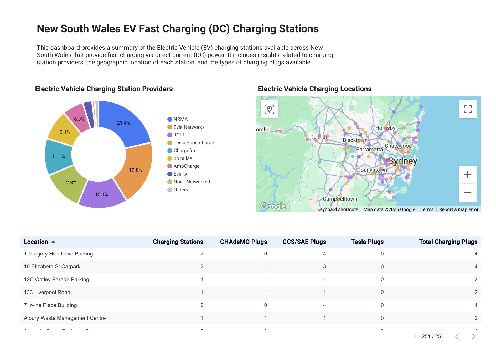

# EV Charging Insights: Python, BigQuery & Looker Studio

Python-based ETL pipeline leveraging dimensional modeling techniques to transform raw CSV data into optimised fact and dimension tables, preparing data for ingestion into **BigQuery** for scalable storage and visualisation in **Looker Studio**.

## Table of Contents
- [Project Overview](#project-overview)
- [Technology Stack](#technology-stack)
- [Setup and Installation](#setup-and-installation)
- [Usage](#usage)
- [Visualisation](#visualisation)

## Project Overview
This project demonstrates how **Python**, **BigQuery** and **Looker Studio** can be used to build a simple ETL and visualisation stack, by providing a means to:
- Extract data from a .csv file.
- Transform the data into separate DataFrames that represent dimensionally modelled fact and dimension tables and export them back to .csv format.
- Ingest the .csv files into **BigQuery** and write a **SQL** view that can be connected to **Looker Studio**.
- Build an insightful dashboard to visualise the fact and dimension data pulled directly from **BigQuery**.

## Technology Stack
- **Python 3.12** - data processing and transformation
- **Polars** - fast DataFrame manipulation
- **BigQuery** - cloud-based data warehouse
- **Looker Studio** - interactive dashboard

## Setup and Installation
1. Clone the repo:
```
git clone https://github.com/data-with-chris/python-bigquery-looker.git
cd python-bigquery-looker
```
2. Create and activate a virtual environment
```
python -m venv venv
source venv/bin/activate   # macOS/Linux
venv\Scripts\activate      # Windows
```
3. Install dependencies
```
pip install -r requirements.txt
```
## Usage
```
python main.py
```
Running the application will produce the fact and dimension table files in .csv format, which can then be ingested into **BigQuery** and used to inform visualisations in **Looker Studio**.

## Visualisation
### Sample:

### Demo
[Click here to see the Looker dashboard](https://lookerstudio.google.com/reporting/4a3a736d-aa3a-46e0-b205-8ed33419baaa)

